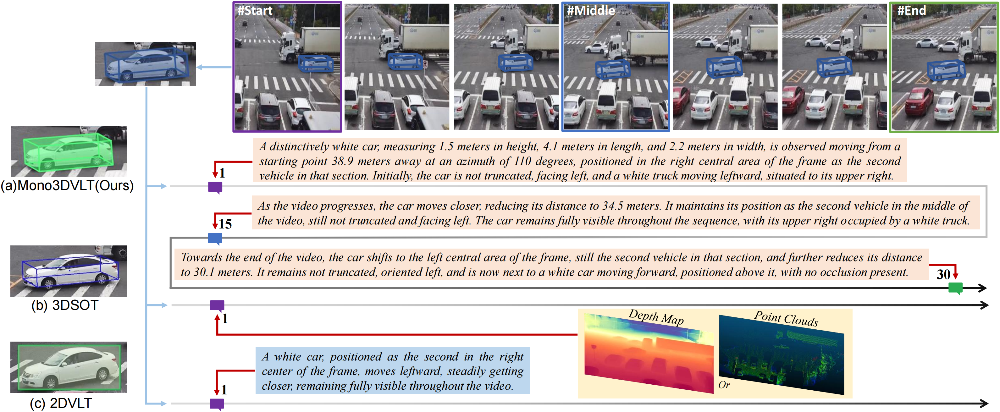
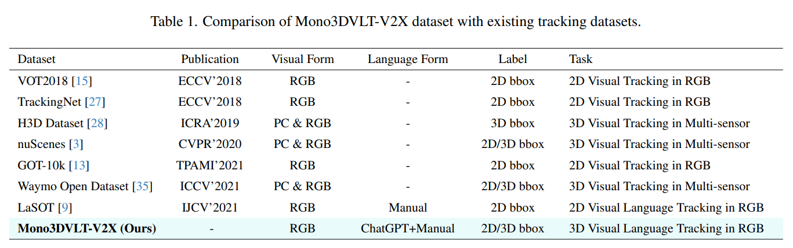
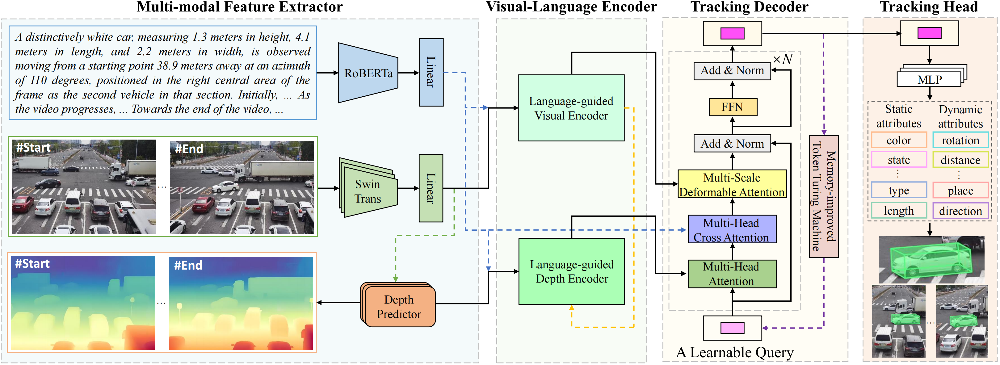
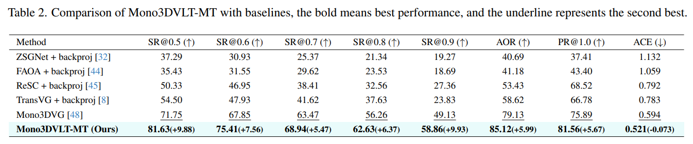

# Mono3DVLT: Monocular-Video-Based 3D Visual Language Tracking
Author: Hongkai Wei, Yang Yang, Shijie Sun, Mingtao Feng, Xiangyu Song, Qi Lei, Hongli Hu, Rong Wang, Huansheng Song, Naveed Akhtar, and Ajmal Saeed Mian

Contact Email: hongkaiwei@chd.edu.cn

The paper has been accepted by **2025 IEEE Conference on Computer Vision and Pattern Recognition (CVPR2025)** 🎉.

**The Code will be released soon!!!**

    

- [Mono3DVLT: Monocular-Video-Based 3D Visual Language Tracking](#lmttm-vmi)
  - [Task: Mono3DVLT](#Mono3DVLT)
  - [Dataset: Mono3DVLT-V2X](#Dataset)
  - [Architecture: Mono3DVLT-MT](#Mono3DVLT-MT)
  - [Visualization](#Visualization)
  - [Results](#Results)

    

## 💬 Mono3DVLT: 3D Visual Language Tracking in Monocular Videos
The Mono3DVLT task focuses on 3D single object tracking from a monocular video guided by natural language cues. This task bridges traditional machine object tracking and human-like object tracking by utilizing visual and language inputs to interpret real-world 3D objects through monocular videos. 

  

## 🗃️ Dataset
To facilitate research on this newly introduced task, we release a comprehensive dataset called Mono3DVLT-V2X, derived from V2X-Seq, comprising 79,158 segments of natural language descriptions that map to specific single object tracking within a monocular video. These descriptions are generated by ChatGPT and then refined manually. 

**The Dataset will be released soon!!!**

  

## 💡 Mono3DVLT-MT: Architecture

Mono3DVLT-MT is the **first end-to-end network** for monocular 3D visual language tracking. 

  

## 👁️ Visualization

### Visualizations from our Mono3DVLT-MT on our Mono3DVLT-V2X Dataset.

  

  

  

  

  

  

## 🔍 Results

### Comparison Mono3DVLT-MT with baselines on Mono3DVLT-V2X Dataset.

  

  

Fig.1 Visualization of Comparing our model's results with those of the best-performing existing models. The visualization includes both predicted and ground truth 3D bounding boxes displayed separately for clarity. Blue boxes represent ground truth, while green boxes indicate predictions. The scene captures a video tracking a white car driving left in the distance.

  

Fig.2 Visualization of Comparing our model's results with those of the best-performing existing models. The visualization includes both predicted and ground truth 3D bounding boxes displayed separately for clarity. Blue boxes represent ground truth, while green boxes indicate predictions. The scene captures a video tracking a red truck making a left turn from the opposing lane, approaching from the top-left corner.

  

Fig.3 Visualization of Comparing our model's results with those of the best-performing existing models. The visualization includes both predicted and ground truth 3D bounding boxes displayed separately for clarity. Blue boxes represent ground truth, while green boxes indicate predictions. The scene captures a video tracking a white bus driving forward on a wet road, viewed from directly above.

  

Fig.4 Visualization of Comparing our model's results with those of the best-performing existing models. The visualization includes both predicted and ground truth 3D bounding boxes displayed separately for clarity. Blue boxes represent ground truth, while green boxes indicate predictions. The scene captures a video tracking a white car from above as it makes a left turn from the opposing lane.

  

Fig.5 Visualization of Comparing our model's results with those of the best-performing existing models. The visualization includes both predicted and ground truth 3D bounding boxes displayed separately for clarity. Blue boxes represent ground truth, while green boxes indicate predictions. The scene captures a video tracking a white truck on the right side of the frame driving straight toward the left.

  

Fig.6 Visualization of Comparing our model's results with those of the best-performing existing models. The visualization includes both predicted and ground truth 3D bounding boxes displayed separately for clarity. Blue boxes represent ground truth, while green boxes indicate predictions. The scene captures a video tracking a white bus driving straight forward, viewed from directly below. 
